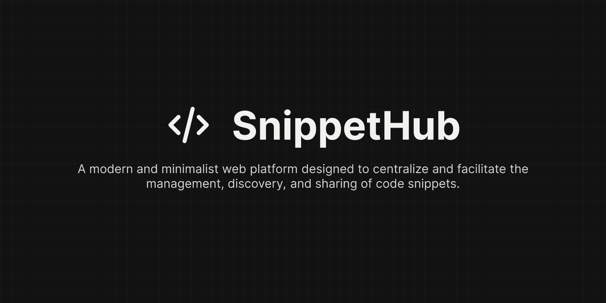

<div align="center">




<a href="#overview">Overview</a>
•
<a href="#✨-key-features">Key Features</a>
•
<a href="#🚀-getting-started-local-setup">Getting Started</a>

</div>

## Overview

**SnippetHub** is a modern and minimalist web platform designed to centralize and facilitate the **management, discovery, and sharing of code snippets**. In a world where developers constantly seek quick solutions and references, SnippetHub positions itself as the personal and collaborative hub where you can organize your own code knowledge and explore the expertise of others.

The platform allows users to **create, edit, and view snippets** with **syntax highlighting** for various programming languages. Each snippet can be categorized with **tags** for easy searching and filtering.

## ✨ Key Features

- **Snippet Creation:** Publish your own valuable code fragments with descriptive titles, clear explanations, and associated programming languages. Existing snippets can be edited at any time.
- **Syntax Highlighting:** Clear and readable code visualization with automatic highlighting based on the selected language, improving comprehension.
- **Tag Management:** Associate multiple tags with each snippet for flexible organization and efficient search. Users can create new tags instantly.
- **Search and Filtering:** Quickly find specific snippets using the search bar and filters by language or tags. (Assuming you implemented search, if not, adjust this).
- **User Authentication:** Secure registration and login, allowing users to manage their own snippets.
- **Intuitive User Interface:** Clean, modern design with a **dark theme** that prioritizes user experience and readability.
- **Dedicated Snippet Pages:** Each snippet has its own page, displaying the code, description, metadata, and potentially related snippets.
- **"My Snippets" Page:** A personal area where users can view and manage all the snippets they have created. (If you implemented this functionality).

## 🚀 Getting Started (Local Setup)

Follow these steps to get a local copy of SnippetHub up and running on your machine.

### Prerequisites

Make sure you have the following installed:

- [Node.js](https://nodejs.org/en/download/) (version 18 or higher recommended)
- [npm](https://www.npmjs.com/get-npm) or [pnpm](https://pnpm.io/installation)

### Installation

1.  **Clone the repository:**

    ```bash
    git clone [https://github.com/GFrancV/snippet-hub.git](https://github.com/GFrancV/snippet-hub.git)
    cd snippet-hub
    ```

2.  **Install dependencies:**

    ```bash
    pnpm install
    ```

3.  **Configure your Environment Variables:**
    Create an `.env` file in the root of your project and add your Supabase and Clerk credentials. You can obtain these from your Supabase and Clerk dashboards.

    ```dotenv
    # Supabase
    PUBLIC_SUPABASE_URL="your_supabase_url"
    PUBLIC_SUPABASE_ANON_KEY="your_supabase_anon_key"
    SUPABASE_SERVICE_ROLE_KEY="your_supabase_service_role_key" # Use with caution in the backend

    # Clerk
    CLERK_SECRET_KEY="sk_your_clerk_secret_key"
    PUBLIC_CLERK_PUBLISHABLE_KEY="pk_your_clerk_publishable_key"
    ```

4.  **Run the development server:**
    ```bash
    npm run dev
    # or
    yarn dev
    ```
    The project will be available at `http://localhost:4321` (or the port Astro assigns).
